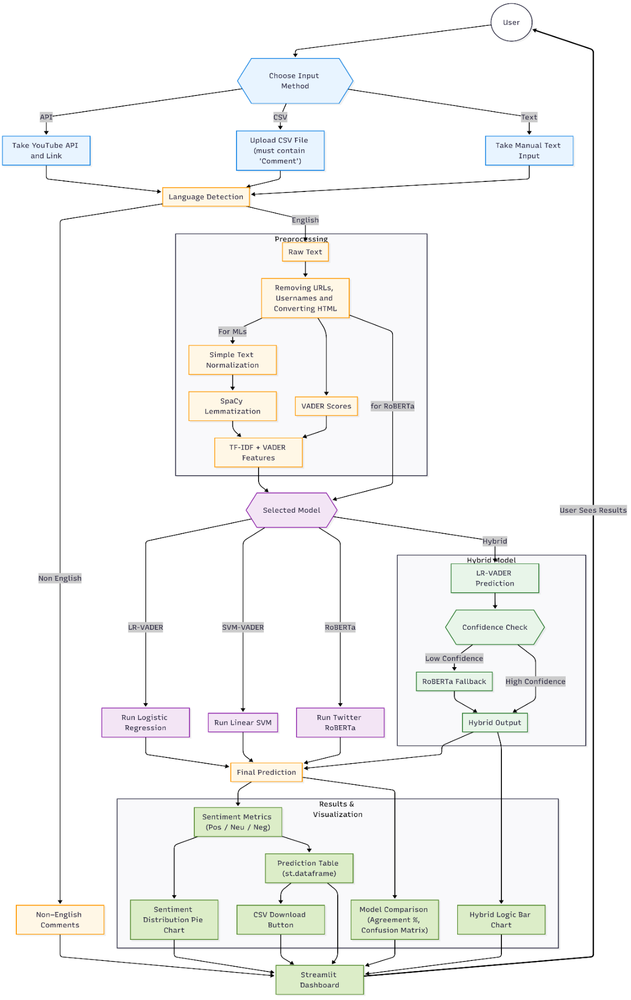
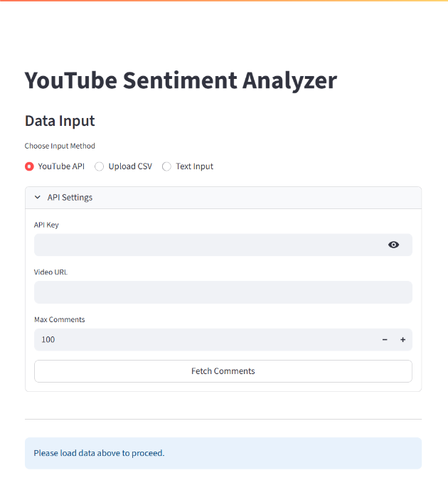
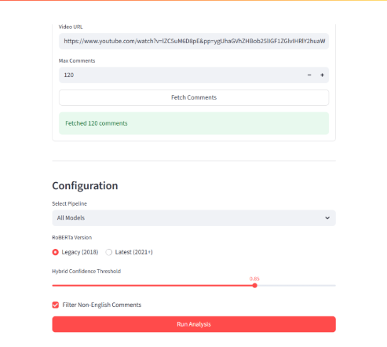
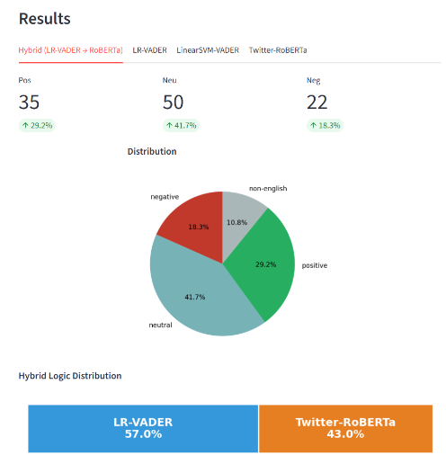
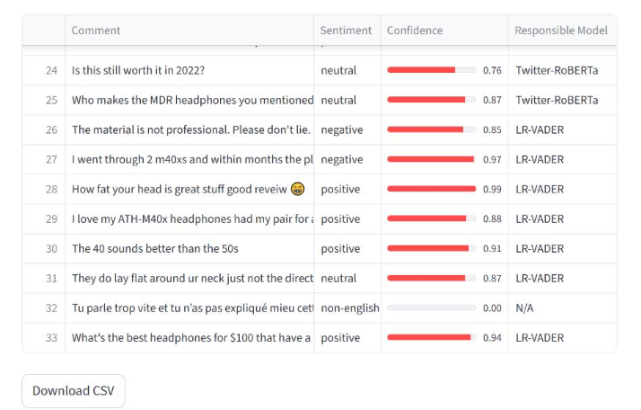

# 📊 تحلیل احساسات نظرات یوتیوب

یک وب‌اپلیکیشن کاملاً تعاملی ساخته‌شده با **Streamlit** برای دانلود نظرات یوتیوب و تحلیل احساسات آن‌ها با استفاده از چندین مدل NLP شامل:

* **Twitter RoBERTa (HuggingFace)**
* **مدل هیبریدی (LR-VADER → در صورت عدم اطمینان RoBERTa)**
* **مدل Logistic Regression + ویژگی‌های VADER**
* **مدل Linear SVM + ویژگی‌های VADER**
* **مدل‌های سفارشی ذخیره‌شده با joblib**

---

## قابلیت‌های اپلیکیشن

✓ استخراج خودکار نظرات یوتیوب
✓ امکان آپلود فایل CSV
✓ مقایسه چند مدل مختلف NLP
✓ تشخیص زبان و فیلتر کردن آن
✓ مدل هیبریدی مبتنی بر confidence
✓ نمایش ماتریس درهم‌ریختگی (Confusion Matrix)
✓ دانلود خروجی نتایج

---

## 🚀 ویژگی‌ها

### 🔹 1. دریافت نظرات یوتیوب

با وارد کردن لینک ویدیو + API Key می‌توانید تا **۵۰۰۰ کامنت** را از طریق YouTube Data API دریافت کنید.

---

### 🔹 2. آپلود CSV

می‌توانید یک فایل `.csv` که شامل ستون `Comment` است آپلود کنید تا تحلیل آفلاین انجام شود.

---

### 🔹 3. مدل‌های مختلف NLP

می‌توانید تحلیل احساسات را با مدل‌های زیر انجام دهید:

| مدل                   | توضیح                                                     |
| --------------------- | --------------------------------------------------------- |
| **Twitter-RoBERTa**   | مدل ترنسفورمر از HuggingFace (بالاترین دقت)               |
| **Hybrid Model**      | ترکیب LR + VADER و در صورت عدم اطمینان استفاده از RoBERTa |
| **LR-VADER Models**   | رگرسیون لجستیک با ویژگی‌های VADER                         |
| **Linear SVM Models** | مدل SVM با ویژگی‌های VADER                                |
| **All Models**        | اجرای همه مدل‌ها و مقایسه آن‌ها                           |

---

### 🔹 4. تشخیص زبان

با استفاده از کتابخانه `langdetect`، کامنت‌های غیرانگلیسی شناسایی و برچسب‌گذاری می‌شوند.

---

### 🔹 5. مراحل پیش‌پردازش (Preprocessing Pipeline)

شامل موارد زیر است:

* حذف و نرمال‌سازی URL و mentionها
* تبدیل ایموجی‌ها (emoji demojization)
* Lemmatization
* استخراج ویژگی‌های VADER
* پاک‌سازی با Regex
* استفاده از tokenizer مربوط به HuggingFace

---

### 🔹 6. خروجی قابل دانلود

هر تب مربوط به مدل شامل موارد زیر است:

* نمودار دایره‌ای احساسات
* نمایش تصمیم مدل در حالت هیبریدی
* ماتریس درهم‌ریختگی (Confusion Matrix)
* دکمه دانلود فایل `.csv`

---

## نحوه عملکرد سامانه


---
## 📂 ساختار پروژه

```text
project/
│
├── app.py                  # اپلیکیشن اصلی Streamlit
├── final_lr_sentiment_model.joblib
├── more_data_lr_model.joblib
├── final_linear_svm_model.joblib
├── linear_svm_model.joblib
└── roberta-local/          # (اختیاری) مدل RoBERTa دانلودشده به صورت محلی
```

---

## 🔧 راه‌اندازی پروژه

### 1. نصب وابستگی‌ها

```bash
pip install -r requirements.txt
```

---

### 2. اجرای اپلیکیشن

```bash
streamlit run app.py
```

---

## 🔑 تنظیم API یوتیوب

برای استفاده از حالت API:

1. ساخت API Key در Google Cloud Console
2. فعال‌سازی **YouTube Data API v3**
3. وارد کردن API Key در رابط کاربری

---

## 🧠 نحوه عملکرد مدل هیبریدی

1. اجرای Logistic Regression + VADER
2. اگر میزان اطمینان (confidence) کم باشد، ارسال متن به RoBERTa
3. ترکیب نتایج
4. خروجی شامل:

   * احساس (Sentiment)
   * میزان اطمینان
   * اینکه کدام مدل تصمیم گرفته است

این روش باعث افزایش دقت و کاهش هزینه استفاده از RoBERTa می‌شود.

---

## 📈 مقایسه مدل‌ها

زمانی که چند مدل اجرا می‌شوند، سیستم به صورت خودکار:

* هر مدل را با RoBERTa مقایسه می‌کند
* میزان توافق (agreement score) را محاسبه می‌کند
* ماتریس درهم‌ریختگی را برای کامنت‌های انگلیسی تولید می‌کند

---

## 🛡 مدیریت خطا و تجربه کاربری

* fallback در صورت نبود HuggingFace یا GPU یا langdetect
* استفاده از spinner و progress bar در Streamlit
* نمایش هشدارهای واضح برای کاربر
* لاگ‌گیری از خطاها به صورت robust


## تصاویری از خروجی
---

---

---

---

